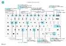

# Snelle toetsenbordnaslag - alleen pcKeyboard Quick Reference - PC Only

#### Alge&meenGeneral

|Druk op deze toetsenPress these keys|ActieTo do this|  
|-|-|
|Alt+F2Alt+F2 Alt+NAlt+N Alt+Shift+NAlt+Shift+N Alt+OAlt+O Alt+QAlt+Q Alt+Pijl omhoogAlt+Up Alt+Pijl-omlaagAlt+Down Arrow Alt+TAlt+T Alt+Shift+WAlt+Shift+W Ctrl+InsertCtrl+Insert Ctrl-DeleteCtrl-Delete Ctrl+Shift+F12Ctrl+Shift+F12 Ctrl+F1Ctrl+F1 Ctrl+klikkenCtrl+Click Shift+F12Shift+F12 F5/Ctrl+F5F5/Ctrl+F5 Tab/Shift+TabTab/Shift+Tab F6/Shift+F6F6/Shift+F6 |Het deelvenster Feitenblok weergeven of verbergenShow and hide the FactBox pane Een nieuwe record makenCreate a new record Een nieuw gemaakte record sluiten en een nieuwe makenClose a newly created record and create a new one Een nieuwe notitie toevoegen voor de geselecteerde recordAdd a new note for the selected record **Vertel me** openenOpen **Tell me** Knopinfo openen of validatiefoutOpen tooltip or validation error Een vervolgkeuzelijst of opzoekactie openenOpen a drop-down or look up De pagina **Mijn instellingen** openenOpen the **My Settings** page De huidige kaart of het huidige document openen in een nieuw vensterOpen the current card or document in a new window Een nieuwe regel in een document invoegenInsert a new line on a document De regel verwijderen uit een document, een dagboek of een werkbladDelete the line on a document, journal, or worksheet Het gedeelte met regelitems maximaliseren op een documentpaginaMaximize the line items part on a document page Help voor de pagina openenOpen help for the page Navigeren bij het personaliseren en aanpassenNavigate when personalizing and customizing Open de rollenverkenner, een functieoverzichtOpen the role explorer, a feature overview Pagina vernieuwen/opnieuw ladenRefresh/reload page Focus verplaatsen naar volgende/vorige elementMove focus to the next/previous element Naar het volgende sneltabblad/onderdeel gaanMove to next FastTab/part|

#### Navigeren en rijen selecterenNavigate & Select Rows

|Druk op deze toetsenPress these keys|ActieTo do this|
|-|-|
|Home/EndHome/End Ctrl+Home/EndCtrl+Home/End  Ctrl+pijl omhoog/pijl omlaagCtrl+Up/Down Ctrl+ACtrl+A  Ctrl+SpatiebalkCtrl+Space Ctrl/Shift+klikkenCtrl/Shift+Click Shift+pijl omhoog/pijl omlaagShift+Up/Down Shift+Page Up/DownShift+Page Up/Down Ctrl+EnterCtrl+Enter|Naar het eerste/laatste veld gaanGo to first/last field Naar de eerste/laatste rij gaanGo to first/last row Navigeren zonder de selectie te verliezenNavigate without losing selection Alles selecterenSelect all Selectie in-/uitschakelenToggle row selection  De rij(en) toevoegen aan de selectieAdd the row/rows to the selection Rij toevoegen boven/onder selectieAdd row above/below to selection Zichtbare rijen boven/onder selecterenSelect visible rows above/below  Focus uit de lijst verplaatsenFocus out of the list|

#### Kopiëren en plakkenCopy & Paste

|Druk op deze toetsenPress these keys|ActieTo do this|
|-|-|
|Ctrl+C/VCtrl+C/V F8F8|Rijen kopiëren/plakkenCopy/paste rows Veld erboven naar huidige rij kopiërenCopy field above into current row|

#### Zoeken, filteren en sorterenSearch, Filter, & Sort

|Druk op deze toetsenPress these keys|ActieTo do this|
|-|-|
|Alt+F7Alt+F7 F3F3 Shift+F3Shift+F3 Ctrl+Shift+F3Ctrl+Shift+F3 Alt+F3Alt+F3 Shift+Alt+F3Shift+Alt+F3 Ctrl+Alt+Shift+F3Ctrl+Alt+Shift+F3|Kolom sorteren in oplopende of aflopende volgordeSort column in ascending/descending order Zoeken in-/uitschakelenToggle search Filterdeelvenster in-/uitschakelen; focus op veldfiltersToggle filter pane; focus on field filters Filterdeelvenster in-/uitschakelen; focus op totalenfiltersToggle filter pane; focus on totals filters Filteren op geselecteerde celwaardeFilter on selected cell value Filter op een geselecteerd veld toevoegenAdd filter on selected field Filters opnieuw instellenReset filters|

#### SnelinvoerQuick Entry

|Druk op deze toetsenPress these keys|ActieTo do this|
|-|-|
|Ctrl+Shift+EnterCtrl+Shift+Enter Enter/Shift+EnterEnter/Shift+Enter|Naar volgende snelinvoerveld buiten een lijst gaanGo to next Quick Entry field outside a list Naar volgende/vorige snelinvoerveld gaanGo to next/previous Quick Entry field|

##### RapportvoorbeeldReport Preview

|Druk op deze toetsenPress these keys|ActieTo do this|
|-|-|
|Ctrl+Home/EndCtrl+Home/End|Naar de eerste/laatste pagina gaanGo to the first/last page|

> [!TIP]
> Kies de volgende afbeelding voor een grafische, afdrukbare weergave en download het PDF-bestand.For a graphical, print-friendly version, choose the following image and download the PDF file.
>
> 
